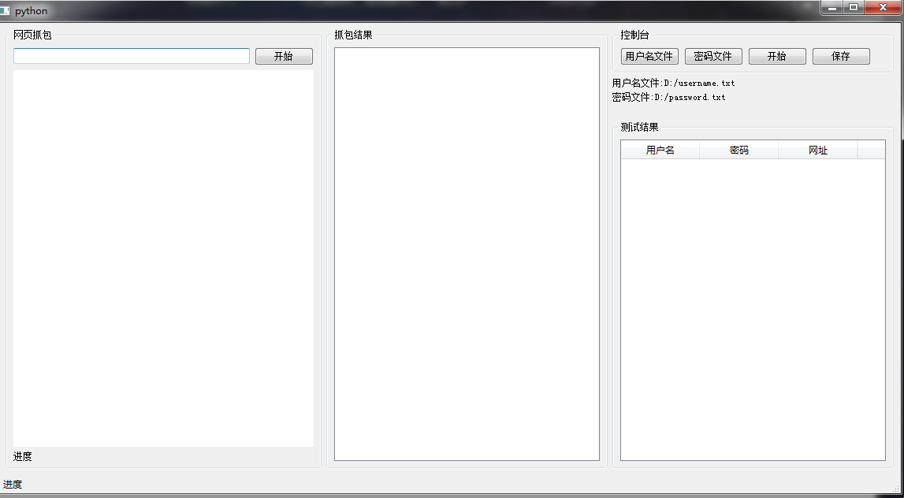

### 基于流量的密码爆破程序
这个程序是[基于网页结构的密码爆破程序](https://github.com/spoock1024/brutepwdbyhtml)的姊妹篇。因为在编写基于网页结构的密码爆破程序的时候，我发现不是所有的程序都会通过传统的form表单的形式来进行提交，很多的程序都是通过Ajax的技术来进行提交，遇到了这种情况，那么之前基于网页结构，其实就是分析form表单的方式无法处理了。这个时候就写了一个基于流浪的密码爆破程序。

这个程序大部分的的功能和之前基于网页结构的密码爆破程序类似，区别就是在获取请求参数上面。本程序的界面如下:

由于需要抓取提交的的流量，那么就需要通过设置代理来获得用户提交的数据。所以在界面的最左边是一个浏览器(就是Qt中的WebView)，同时在这个浏览器的背后有一个代理，通过代理截获用户的数据。当输入网站输入用户密码之后，程序就会分析请求包的数据，获得请求的url，host，parameter,Referer等等。在获得了parameter之后，同时还是结合网页的参数信息，这样就可以筛选出提交的参数中用户名和密码。之后剩下的工作就是选择用户名字典和密码字典进行爆破

写到这里，发现了这2个程序还是存在一个问题。就是整个参数识别的过程中，用户无法进行修正。即，当程序识别参数错误的时候，例如将u识别为了用户名的提交参数，但实际上的参数是usrname。这个时候，程序后面进行的爆破完全是无效的，所以整个过程对用户来说完全是透明的。但是像burpsuit,pkav都是需要用户手动地标记参数，然后用户需要为每个参数选择一个字典进行提交爆破。所以这也是目前此程序为了做到高度的自动化而留下的一个缺陷。
